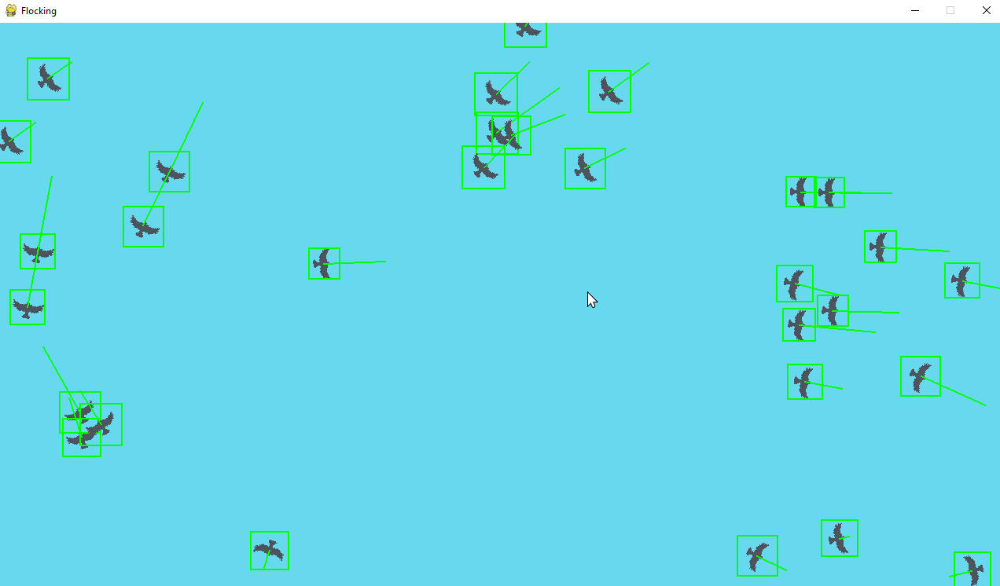

# 🦅 Flocking Simulation

***


***


***

## 📜 About

There is beauty in simplicity.

[Compliant mechanisms](https://compliantmechanisms.byu.edu/about-compliant-mechanisms) are a great example of complexity within simplicity. A compliant mechanism is a single piece of material that can perform the same complex tasks as a traditional multi-part mechanism. For an excellent demonstration, check out Mark Rober's video on the world's smallest [Nerf Gun](https://www.youtube.com/watch?v=9c2NqlUWZfo).

Another entertaining example of complexity in simplicity is [Evan Zhou's](https://github.com/EvanZhouDev/donut-py) spinning [ASCII](https://simple.wikipedia.org/wiki/ASCII) donut. Inspired by Andy Sloane's [blog post](https://www.a1k0n.net/2011/07/20/donut-math.html) on the mathematics behind the spinning donut, Zhou implemented it in Python. The most impressive aspect is that he crafted the entire script as a single line of code shaped like a donut! When executed, the script renders a spinning ASCII donut in the terminal.

My final example of complexity in simplicity is [Craig Reynolds'](https://www.red3d.com/cwr/index.html) original paper on [boids](https://www.red3d.com/cwr/boids/). The boids algorithm is a simple model of flocking behavior that simulates interactions between individual agents. These agents follow three basic rules: separation, alignment, and cohesion. Separation directs each boid to steer away from its nearby flockmates, preventing overcrowding. Alignment prompts boids to adjust their heading to match the average direction of their local flockmates. Cohesion encourages boids to move towards the center of their local group. The result is a mesmerizing simulation of birds flocking together, demonstrating how complex, lifelike behavior can emerge from a set of straightforward rules. This set of three basic rules can be implemented in video games to create realistic, and visually appealing environments of entities like birds or fish.

I decided to explore this concept by creating a simple flocking simulation in Python. The simulation uses the boids algorithm to model the flocking behavior of birds. The boids interact with each other based on the three rules of separation, alignment, and cohesion. The result is a visually appealing simulation of birds flocking together on the screen. The simulation allows you to customize the number of boids, their speed, and other parameters to observe the flocking behavior in action. You can also enable debug mode to visualize the vectors for alignment and cohesion, providing insight into how the boids interact with each other.


## 🚀 Features

- **Flocking Simulation**: Simulate the flocking behavior of birds using the boids algorithm
- **Customization**: Adjust the number of boids, speed, and other parameters to customize the simulation
- **Visualization**: Watch the boids interact on screen and observe their flocking behavior
- **Environment Variables**: Use environment variables to configure the simulation
- **Debug Mode**: Enable debug mode to visualize the vectors for alignment



## 🛠️ Installation

1. Ensure you have Python 3.11+ installed on your system.
2. Clone this repository:
   ```
   git clone https://github.com/johandielangman/flocking.git
   ```
3. Navigate to the project directory:
   ```
   cd flocking
   ```
4. Install the required dependencies:
   ```
   pip install -r requirements.txt
   ```
5. Run the simulation (see [Usage](#-usage) for instructions).

## 🎮 Usage

To run the simulation:

1. Navigate to the project directory in your terminal.
2. Run the main script:
   ```
   python main.py
   ```
3. Watch as the boids flock together on the screen.
4. Close the window to end the simulation.

## ⚙️ Configuration

You can modify the following parameters in [constants.py](constants.py) to customize the simulation:

- `NUM_BOIDS`: The number of boids in the simulation
- `MAX_BOID_SPEED`: The maximum speed of the boids
- `MIN_BOID_SPEED`: The minimum speed of the boids
- `MAX_BOID_ACCELERATION`: The maximum acceleration of the boids (also known as the maximum force since each boid has a mass of 1)
- `PERCEPTION_RADIUS`: The radius within which boids perceive other boids
- `SAC_WEIGHTS`: A tuple of floats representing the weights for separation, alignment, and cohesion


## 🤝 Contributing

Contributions, issues, and feature requests are welcome! Feel free to check [issues page](https://github.com/Johandielangman/RPS-simulation/issues) if you want to contribute.

## 📝 License

This project is [MIT](https://choosealicense.com/licenses/mit/) licensed.

## 🙏 Acknowledgements

- [Craig Reynolds](https://www.red3d.com/cwr/index.html) for his original paper on boids
- [The Coding Train](https://www.youtube.com/watch?v=mhjuuHl6qHM&t=2227s) for the inspiration and guidance on implementing the boids algorithm

---

Made with ❤️ by Johandielangman

[](https://buymeacoffee.com/johanlangman)